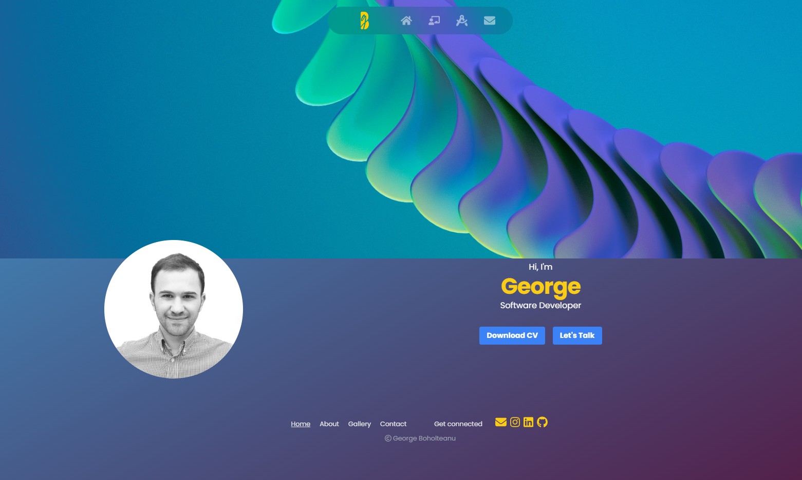

# React Portfolio


React Portfolio App summarizes my current work experience as a web developer using React JS.

&nbsp;

## Description

The app is a Single Page Application created with JS, HTML and CSS. 

**Frameworks**: REACT, Node JS, Tailwind CSS.

&nbsp;

## Table of contents

- [React Portfolio](#react-portfolio)
  - [Description](#description)
  - [Table of contents](#table-of-contents)
    - [**Installation instructions**](#installation-instructions)
    - [**Usage**](#usage)
    - [**License type**](#license-type)
    - [**Contribution guidelines**](#contribution-guidelines)
    - [**Testing instructions**](#testing-instructions)
    - [**Questions**](#questions)

&nbsp;

### **Installation instructions**

Software requirements:

- Text editor. [VS Code](https://code.visualstudio.com/) is recommended
- [Git](https://git-scm.com/downloads)
- [Node JS](https://nodejs.org/en/download/)
- All project dependencies can be found in ***package.json***  and can be installed using ***npm install \<module name>***


&nbsp;

### **Usage**

The application will be invoked by using the following command:

```bash
npm start
```

Then, user will be presented with the website in default browser.

&nbsp;
**App Demo** 

[](https://github.com/georgeboholteanu/react-portfolio "Demo")

&nbsp;

### **License type**

  The application is covered under **MIT** license. More about it can be found here [MIT license info](https://opensource.org/license/mit/).

&nbsp;

### **Contribution guidelines**

Contributions are welcomed. Please verify you are submitting well-formed pull requests and open useful issues.

&nbsp;

### **Testing instructions**

Testing can be ran locally after a pull request has been made successfully and required modules have been installed.

&nbsp;

### **Questions**

For any questions or feedback please ping me a message on **[Github](https://github.com/georgeboholteanu)** or send an email at <george.boholteanu@gmail.com>

&nbsp;

---
© 2023 George Boholteanu. All Rights Reserved.
